# Monitoramento de Disponibilidade de Website com Notificações

Este projeto consiste em um script Bash para monitorar a disponibilidade de um website especificado e enviar notificações para o Discord, caso o site esteja inacessível.

## Tecnologias Utilizadas

* **Bash:** Linguagem de script utilizada para desenvolver a lógica de monitoramento e envio de notificações.
* **curl:** Ferramenta de linha de comando para transferir dados com URLs. Utilizada para fazer requisições HTTP ao website monitorado e enviar mensagens para as APIs dos serviços de notificação.
* **nginx:** Servidor web utilizado para simular a indisponibilidade do website localmente durante os testes.
* **systemctl:** Utilitário para controlar o sistema systemd, utilizado para verificar e controlar o status do serviço Nginx (durante os testes).
* **ufw (Uncomplicated Firewall):** Interface para iptables, utilizada para configurar o firewall (durante os testes de simulação de queda).
* **Webhook Discord:** Mecanismo para enviar mensagens automatizadas de um aplicativo para outro. Utilizados para enviar alertas para o Discord.
* **sleep:** Comando para pausar a execução do script por um determinado período, utilizado para definir o intervalo de monitoramento.
* **Redirecionamento de Output (`>>`):** Utilizado para escrever logs em um arquivo específico (`/var/log/monitoramento_projeto.log`).

## Funcionalidades

* **Monitoramento de Website:** Verifica a disponibilidade de um website a cada minuto através de uma requisição HTTP HEAD.
* **Detecção de falha:** Identifica quando o website não responde ou retorna códigos de erro.
* **Notificações:** Envia alertas em tempo real para Discord (via Webhook)
* **Logging:** Registra a data, hora e status da verificação (disponível/inacessível) em um arquivo de log (`/var/log/monitoramento_projeto.log`).
* **Configuração Simples:** Permite configurar facilmente a URL do website a ser monitorado e as URLs/tokens dos webhooks e API do Telegram.
* **Timeout:** Define um tempo máximo de espera para a resposta do servidor web.

## Como Utilizar

### Pré-requisitos:

* Acesso a um sistema Linux com Bash instalado.
    * No meu caso, utilizei uma VM (máquina virtual) com o [VirtualBox](https://www.virtualbox.org/)
      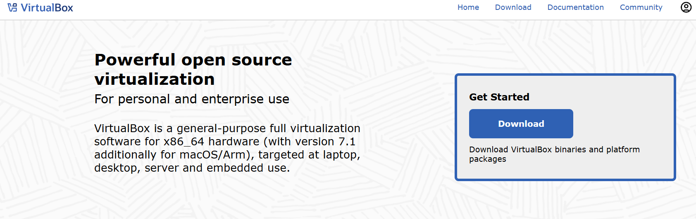
    * e criei uma máquina virtual utilizando o [Xubuntu](https://xubuntu.org/)
      
    * Com isso, é só abrir o terminal com `Ctrl+Alt+T` ou clicando na opção "Terminal" caso você esteja utilizando uma VM com interface gráfica.
      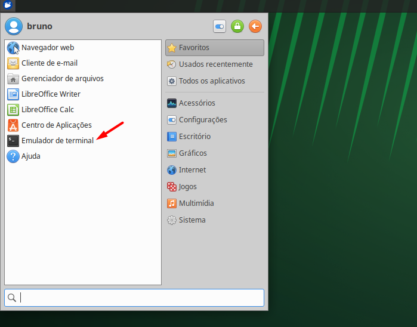
    * Assim, com o terminal aberto, podemos começar as instalações.

* `curl` instalado.
    ```bash
    sudo apt-get install curl
    ```
    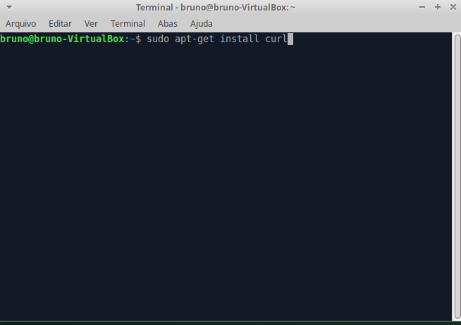

* Para notificar o [Discord](https://discord.com/) com a capacidade de criar webhooks:
    * Primeiro, esteja em um canal onde você tem as funções de administrador.
    * Selecione um canal de texto com o botão direito e clique em "Editar canal".
      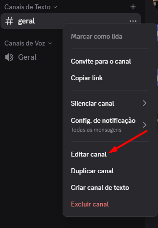
    * Selecione a opção de `Integrações`.
      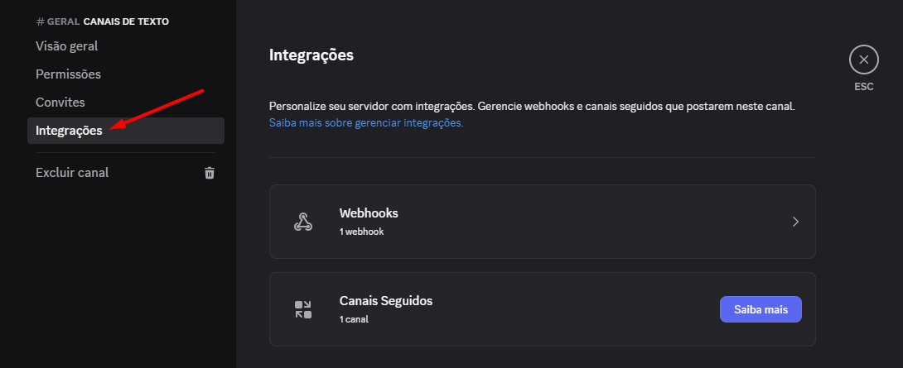
    * E clique em `Webhooks` e em "Criar novo webhook".
      
    * O seu Webhook estará pronto e é só clicar em "Copiar URL do Webhook" para adicionar ao nosso script.
      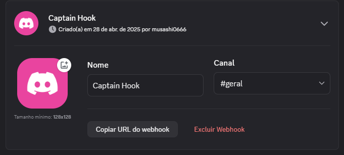

* **Nginx instalado e configurado (necessário para o teste de falha local).**
    Para simular uma falha do website localmente, você precisará ter o Nginx configurado para servir algum conteúdo. Se você já tem um site local rodando com Nginx, pode pular esta etapa. Caso contrário, siga estes passos básicos:
    * **Instale o Nginx:**
      ```bash
      sudo apt update
      sudo apt install nginx
      ```
    * **Crie um arquivo de configuração para o seu site (opcional, se já tiver um):**
      Crie um arquivo em `/etc/nginx/sites-available/seusite` (substitua `seusite` pelo nome desejado):
      ```nginx
      server {
          listen 8080;
          server_name localhost;
          root /var/www/html; # Ou o diretório onde seus arquivos HTML estão

          index index.html index.htm;

          location / {
              try_files $uri $uri/ /index.html;
          }
      }
      ```
    
    * **Crie um arquivo `index.html` básico em `/var/www/html` (ou no diretório `root` configurado):**
      ```bash
      sudo nano /var/www/html/index.html
      ```
      Adicione algo como:
      ```html
      <!DOCTYPE html>
        <html lang="pt-br">
        <head>
        <meta charset="UTF-8">
        <title>Bem vindo a página do projeto!</title>
        <style>
            html { color-scheme: light dark; }
            body { width: 35em; margin: 0 auto;
            font-family: Tahoma, Verdana, Arial, sans-serif; }
        </style>
        </head>
        <body>
        <h1>Bem vindo a página do projeto</h1>
        <p>Se você está vendo essa página é porque está tudo certo</p>

        <p>para documentação do projeto acesse:
        <a href="https://www.github.com/sirmusashi">Repositório do Projeto</a>.<br/>
        </p>

        <p><em>Feito usando Ubuntu e Nginx.</em></p>
        </body>
        </html>

      ```
    * **Teste a configuração do Nginx:**
      ```bash
      sudo nginx -t
      ```
    * **Reinicie o Nginx:**
      ```bash
      sudo systemctl restart nginx
      ```
    * **Certifique-se de que a variável `URL` no seu script `monitoramento.sh` esteja configurada para `http://localhost` ou o domínio/IP do seu site local para testar o Nginx.**

### Configuração:

1.  Crie ou Salve o script `monitoramento.sh` (o conteúdo do script Bash).
    ```bash
    #!/bin/bash

    # --- CONFIGURAÇÕES ---
    URL="http://localhost:8080/"
    TIMEOUT=10
    ARQUIVO_LOG="/var/log/monitoramento_projeto.log"

    # Configurações para Discord
    DISCORD_WEBHOOK_URL="SEU URL DE WEBHOOK AQUI"
    DISCORD_MESSAGE="⚠️ ALERTA: O Projeto $URL está inacessível!"

    # --- FUNÇÕES ---

    mensagem_log(){
	    echo "$(date) - $1" >> "$ARQUIVO_LOG"
    }

    checar_projeto() {
        if curl -s --head --fail --max-time $TIMEOUT "$URL" > /dev/null 2>&1; then
            return 0 # Site está disponível (código de saída 0)
        else
            return 1 # Site está indisponível (código de saída diferente de 0)
        fi
    }

    notificacao_discord() {
    if [ -n "$DISCORD_WEBHOOK_URL" ]; then
        curl -H "Content-Type: application/json" -X POST -d "{\"content\":\"$DISCORD_MESSAGE\"}" "$DISCORD_WEBHOOK_URL" > /dev/null 2>&1
        echo "$(date) - Mensagem de alerta enviada para o Discord."
    fi
    }

    # --- LOOP PRINCIPAL ---

    while true; do
    mensagem_log "Verificando a disponibilidade de $URL..."
    if ! checar_projeto; then
        mensagem_log "STATUS: INACESSÍVEL - O Projeto $URL não responde."
        notificacao_discord
    else
        mensagem_log "STATUS: DISPONÍVEL - O Projeto $URL está online."
    fi
    sleep 60
    done
    ```
2.  Dê permissão de execução ao script:
    ```bash
    chmod +x monitor_site.sh
    ```
3.  Edite o script para configurar as seguintes variáveis:
    * `URL`: A URL do website a ser monitorado.
    * `TIMEOUT`: O tempo máximo de espera em segundos.
    * `LOG_FILE`: O caminho para o arquivo de log (`/var/log/monitoramento_projeto.log`).
    * `DISCORD_WEBHOOK_URL`: A URL do webhook do Discord .
2.  Dê permissão também ao log:
    ```bash
    chmod +x monitoramento_projeto.log
    ```

### Execução:

Execute o script em segundo plano usando `nohup` ou `screen` ou `tmux`:

```bash
nohup ./monitoramento.sh &
```` 
A página devera ficar assim se vc abrir no seu navegador um http://localhost:8080/ (exemplo):
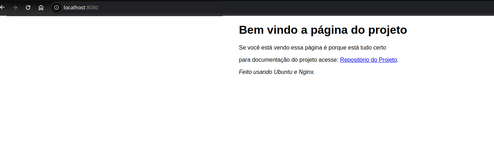
##
### Teste de falha(simulação)
Para verificar se o script está funcionando corretamente, você pode simular uma queda do servidor web monitorado (por exemplo, um servidor Nginx rodando na mesma máquina virtual):

* Parar o serviço Nginx:
 ```Bash
sudo systemctl stop nginx
 ```
 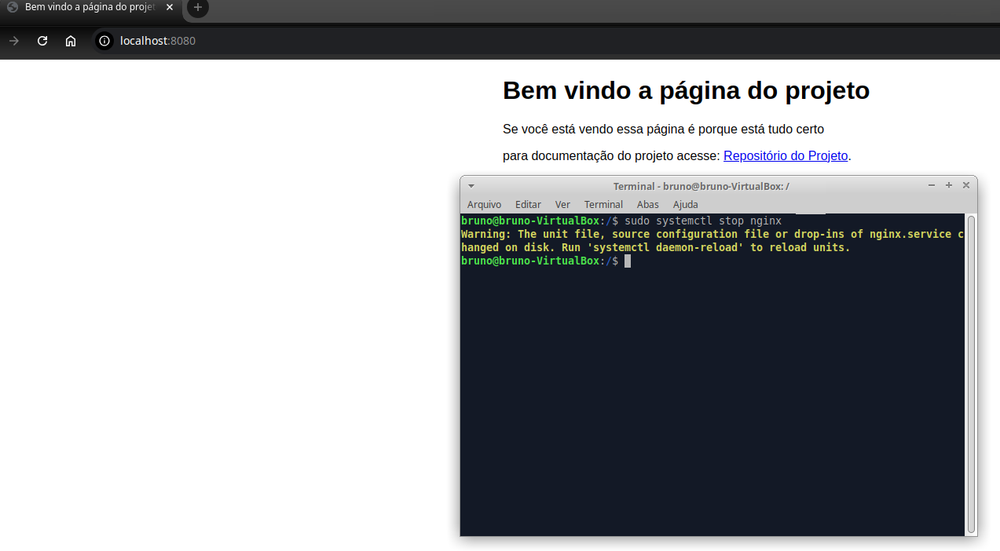
 em seguida caso você atualize a página ela estará offline
 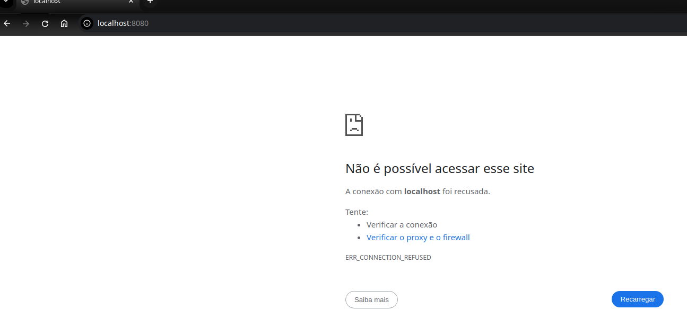
* Verificar a notificação: Aguarde até que o script detecte a falha (aproximadamente 1 minuto) e verifique se você recebeu a mensagem de alerta no Discord.
A notificação virá conforme você configurou!
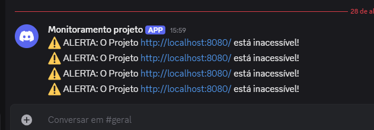


* Iniciar o serviço Nginx novamente:
```Bash
sudo systemctl start nginx
```
* Verificar o log: Monitore o arquivo `/var/log/monitoramento_projeto.log` para ver os registros de quando o site ficou inacessível e quando voltou a ficar disponível.
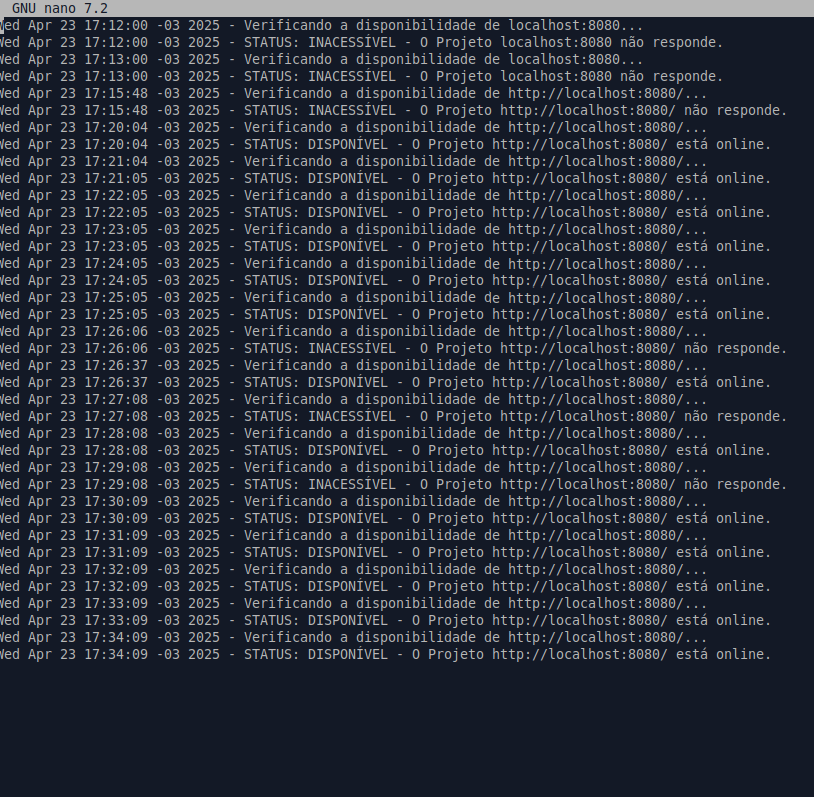
##


### Este README fornece uma visão geral do script, as tecnologias utilizadas e como configurá-lo e testá-lo.
